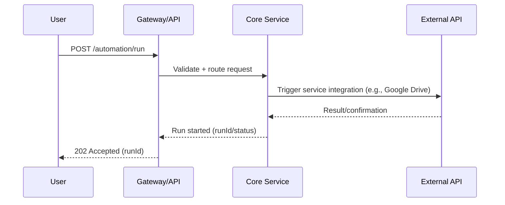

# Architecture Overview

Maintained by BoozeLee, 2025-09-08

## System Architecture

The Woofy McWoofson project is designed with a modular architecture that facilitates scalability, maintainability, and security. Below is an overview of the key components and their interactions.

### Key Components

1. **User Interface**: The front-end application that interacts with users and sends requests to the API.
2. **API Gateway**: Acts as a single entry point for all client requests, handling authentication and routing to the appropriate services.
3. **Core Services**: The backend services that process business logic, interact with databases, and manage integrations with external systems.
4. **Integrations**: Connectors to third-party services (e.g., AWS, Google Drive) that extend the functionality of the core services.
5. **Knowledge Vault**: A centralized repository for documentation, compliance policies, and security guidelines.
6. **Audit Logging**: A system for tracking and recording events and actions taken within the application for security and compliance purposes.

### Data Flow

```mermaid
flowchart TD
    User[User/Client] -->|REST API| Gateway
    Gateway -->|Auth & Routing| CoreServices
    CoreServices -->|Integrations| [Gmail, AWS, Discord, Stripe, Google Drive]
    CoreServices -->|Knowledge Vault| DocsDB
    CoreServices -->|Audit Logging| AuditLog
```

### Sequence of Operations



### Security Considerations

The architecture incorporates security measures at every layer, including:

- **Credential Management**: Secure storage and rotation of sensitive information.
- **Access Control**: Role-based access to APIs and services.
- **Audit Trails**: Comprehensive logging of all actions for accountability and traceability.

### Future Enhancements

- Integration of additional third-party services.
- Implementation of advanced monitoring and alerting systems.
- Continuous improvement of security protocols and compliance measures.

For more detailed information, refer to the [API Specification](../api/openapi.yaml) and the [Knowledge Vault](../../knowledge-vault/README.md).