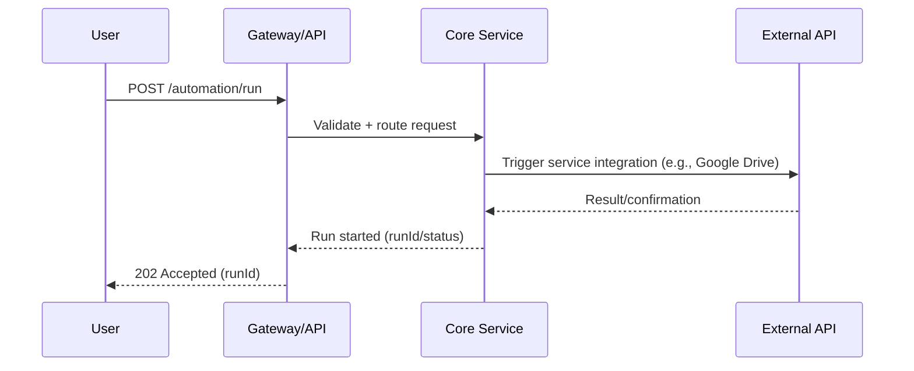
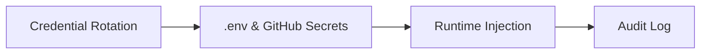

# 🏗️ Bakery Street Project Architecture

Maintained by BoozeLee, 2025-09-08

## System Overview

```mermaid
flowchart TD
    User[User/Client] -->|REST API| Gateway
    Gateway -->|Auth & Routing| CoreServices
    CoreServices -->|Integrations| [Gmail, AWS, Discord, Stripe, Google Drive]
    CoreServices -->|Knowledge Vault| DocsDB
    CoreServices -->|Audit Logging| AuditLog
```

## Sequence: Automation Run



## Security Data Flow



---

## Reference

- [API Spec](../openapi.yaml)
- [Knowledge Vault](../../knowledge-vault/README.md)