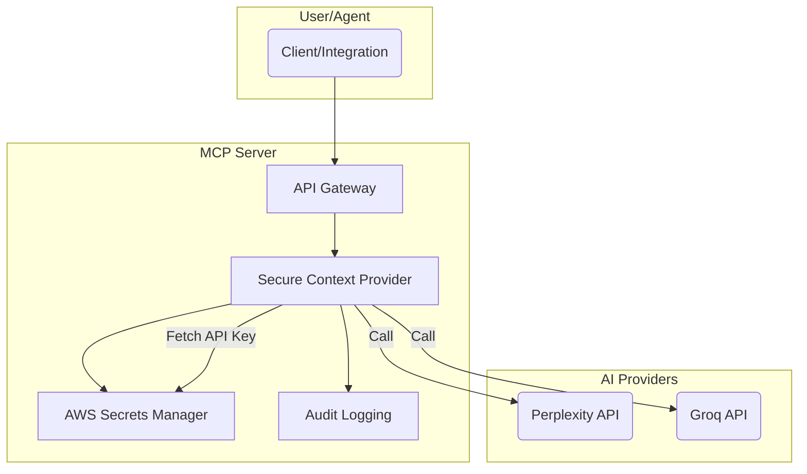

# 🤖 Perplexity + Groq Integration Flow

**Summary:**  
- All secret/API calls are handled by MCP Server, which fetches keys securely from AWS Secrets Manager, routes to Perplexity/Groq, and logs all access for compliance.